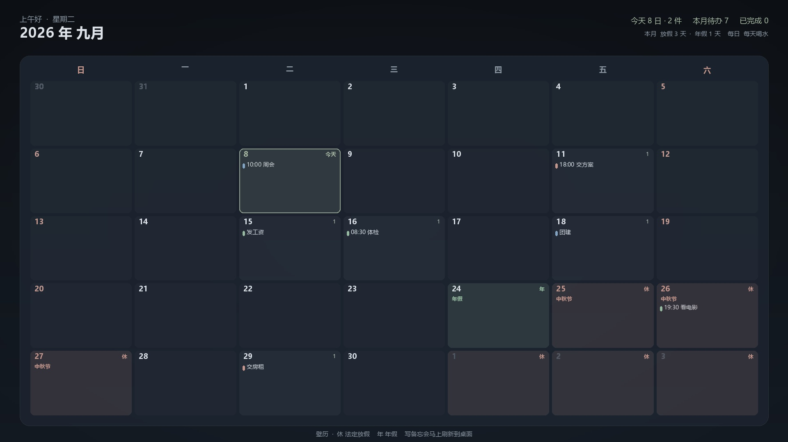

# 壁历 WallCal

**版本 v1.5.5** · Windows 桌面日历备忘录。

把当月日历和每天的安排画成一张壁纸，铺在桌面上。换一天、写一条备忘，壁纸马上刷新。


## 效果

桌面就是一张整月日历。格子里是当天要做的事，法定假日标「休」，年假标「年」。


案例（2026 年 9 月）：每月 15 号发工资、29 号交房租，24 号年假，25–27 中秋放假。



## 功能

- 整月日历壁纸，每天格子里显示当天事项
- 添加、完成、删除备忘，桌面立刻更新
- 日子过了会自动换成新一天的日程
- 法定节假日标在格子上（休），可把自己的年假标上去
- 生活 / 工作 / 重要 标签，可每天、每周或每月重复
- 护眼、墨夜与自定义图片主题，窗口同步配色
- 开机启动（可选）
- GitHub 账号云同步：换电脑登录同一账号，待办和年假会对齐

## 其他电脑怎么用

### 方式一：下载绿色软件（推荐）

1. 打开 [Releases](https://github.com/littlexx15/wallcal/releases)
2. 下载最新的 `WallCal-1.5.5-Windows.zip`，解压后阅读运行须知和卸载说明
3. 双击运行（不用安装 Python）

备忘数据存在当前 Windows 用户的 `%APPDATA%\WallCal\`，换电脑不会自动同步，但源码和软件可以重复下载。

### 方式二：用 Python 跑源码

需要 Python 3.10+。

```bat
git clone https://github.com/littlexx15/wallcal.git
cd wallcal
python -m pip install -r requirements.txt
python main.py
```

或双击 `start.bat` / `启动壁历.bat`。

## 使用

1. 打开窗口后，左边点某一天
2. 右边写下要做的事，回车
3. 这件事会出现在桌面日历对应的格子里
4. 法定放假会标「休」；选中某天可「标成年假」
5. 关掉窗口会缩到任务栏，点任务栏「壁历」还能继续写
6. 彻底退出：窗口右上角「退出」

壁纸本身点不了，写备忘请用窗口。

### 多台电脑同步

1. 点窗口上的 **云同步**
2. 用 GitHub 账号创建一个有 `gist` 权限的令牌并登录
3. 本机会把待办上传到你的**私有** Gist
4. 另一台电脑安装壁历，用**同一个 GitHub 账号**登录，点立即同步

令牌只存在本机 `%APPDATA%\WallCal\sync_auth.json`，不会放进待办文件里。

## 自己打包

```bat
python -m pip install -r requirements.txt pyinstaller
python pack.py
```

生成文件在 `dist\WallCal-1.5.5.exe`。

## 许可证

MIT

## v1.5.5 新功能

- 时间兼容中文冒号、全角数字和冒号两侧的空格，如 `９：３０`。
- 启动自动刷新日期；运行中每 20 秒检查跨天，电脑睡眠恢复后补检查。
- 壁纸串行绘制，只应用最新请求；使用完整写入后的独立图片，不再删除 Windows 壁纸缓存。
- 「显示设置」提供右侧五分之四、右侧约三分之二、紧凑靠右、全屏布局；壁纸字号和软件界面缩放独立设置。
- 默认提高文字对比度；突出今天，淡化过去日期；完成标记直接绘制，不依赖字体中的勾字符。
- 自定义背景会保存本地副本，并随 JSON 备份一起保存。
- 主窗口保持紧凑日历在左、输入区在右上方，事项列表独立滚动；窗口避开任务栏并保存位置尺寸。
- 「标记休假」可批量标记年假、休息、上班，支持自定义名称；个人安排优先，清除后显示法定安排。
- 「导出 / 备份」按日期范围导出 CSV；重复事项按实际发生日期展开，包含完成状态。
- JSON 备份包含全部事项、假期、设置及背景，不含 GitHub 登录令牌；恢复前自动保存当前数据副本，暂停自动云同步。

### 取消壁纸与自动更新

「显示设置 → 停止更新并恢复原壁纸」会停止后续刷新，重启也不会再次接管。点「刷新壁纸」或保存显示设置可重新启用。

首次应用新版壁纸前会备份当时的静态背景和显示方式。若旧版已经覆盖原背景，新版无法凭空找回，请在 Windows 个性化中重新选图；动态壁纸、幻灯片和第三方壁纸软件的运行状态不在恢复范围内。

日期使用 Windows 本机日期。软件退出时不会继续执行刷新；希望每次开机自动更新，请开启「开机启动」。桌面日历仍是静态壁纸，不拦截图标点击；编辑事项需打开应用。

### 开发验证

```bat
python -m unittest discover -s tests -v
python tests/gui_smoke.py
```

GUI 测试使用 `build/gui-test-data` 隔离数据，并模拟系统壁纸应用；会短暂显示测试窗口，预览位于 `build/qa`。也可用环境变量 `WALLCAL_DATA_DIR` 指定独立测试数据目录。新版主要按主显示器绘制，尚未提供每个显示器独立布局。

### v1.5.5 交互修正

普通窗口无需最大化或滚动即可输入备忘。移除主内容嵌套滚动和反复重排；日期按钮与事项卡片复用，切换日期不再整页重建。新增右侧五分之四壁纸布局，可在「显示设置」选择；保留当前布局偏好。

## v1.5.5 自动布局与图片主题

- 「显示设置 → 自动避让图标」读取 Windows 主桌面图标和文字的位置，保留安全间距，在连续空白区域内摆放日历。图标移动后约 20 秒检查一次；已有手动布局仍可使用。
- 只读取位置，不移动图标，不上传截图。无法读取或没有足够的空白区域时保留现有壁纸并显示提示；第三方桌面整理面板、多显示器独立日历暂不支持。
- 「主题下拉框 → ＋ 图片主题…」选择背景图，自动提取配色，支持浅色/深色、强调色微调、命名保存。桌面与整个备忘录窗口共用配色。
- 选中一个图片主题后再次打开图片主题入口可编辑它；切回内置主题后可新建其他图片主题。切换主题不清空未提交的文字。
- 图片主题和所有主题背景随 JSON 备份保存；图片主题留在本机，不通过 GitHub Gist 传输图片或本机文件路径。
- 建议使用主体靠边、留白充足、颜色较少的风景或纹理图片。窗口保留干净卡片底色，文字与强调色自动调整对比度。

桌面位置接口依据 [Microsoft IAccessible::accLocation](https://learn.microsoft.com/en-us/windows/win32/api/oleacc/nf-oleacc-iaccessible-acclocation)。

## 恢复桌面与卸载

首次应用前备份静态原壁纸。旧版无备份时，可在显示设置中选择恢复图片。先停止更新并恢复原壁纸、关闭开机启动、退出程序，再删除 exe。详见 [卸载与恢复说明](卸载与恢复说明.txt)。
