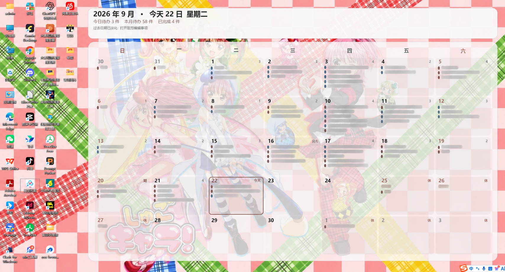
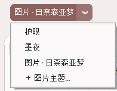
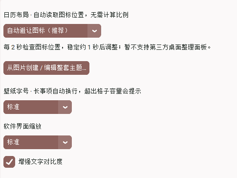
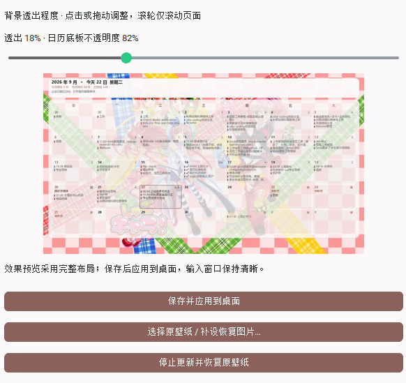

# 壁历 WallCal

**v1.5.9 · Windows 桌面日历备忘录**

把当月日历和每天的安排画成桌面壁纸。选一天，写下备忘，桌面随之更新。

[下载最新版](https://github.com/littlexx15/wallcal/releases/latest) · [运行前须知](运行前须知.txt) · [卸载与恢复说明](卸载与恢复说明.txt)

## 新版更新：用自己的图片做整套主题

在主界面主题下拉框中选择 **「＋ 图片主题…」**，导入喜欢的图片。壁历会从图片提取配色，让桌面日历和写备忘录的窗口一起换色；支持主题命名保存、浅色/深色与强调色调整。

内置主题保留 **护眼、墨夜**，也可以保存多套自定义图片主题。





图片会保存本地副本，移动原图不影响使用。自定义主题和图片包含在完整备份中，不通过 GitHub 云同步上传图片。

## 自动避让桌面图标，字号也能自己调

打开 **「显示设置」**，先选择「日历显示屏幕」（默认主屏幕），刷新只影响选定屏幕。双屏请使用扩展模式；选定屏幕断开时暂停更新，切换时恢复原屏幕壁纸。然后选择 **自动避让图标** 或 **全屏**。自动布局读取 Windows 主桌面的图标位置，在可用的连续空白区域放置日历，无需手动计算桌面占比，也不需要隐藏图标。

- 每 **2 秒**后台检查图标位置，检测到变化后间隔约 **1 秒**再次确认，位置稳定再更新壁纸。
- 图标位置不变就不重绘；只读取位置，不移动图标。
- **壁纸字号**与**软件界面缩放**独立设置，并可开启增强文字对比度。
- 长事项在空间允许时最多显示两行；格子容量有限，超出的事项会提示，完整内容请打开壁历查看。



第三方桌面整理面板暂不支持自动识别。没有足够空白区域或读取失败时，会保留当前壁纸并提示；支持指定一块屏幕显示日历，暂不支持每屏不同日历。

## 背景透出程度可预览，也能恢复原壁纸

在 **「显示设置 → 背景透出程度」**点击或拖动滑杆，调整背景图片的显示程度：往右图片更明显，往左日历底板更实。下方可以预览，点击 **「保存并应用到桌面」**后生效，备忘录输入窗口保持清晰。

鼠标滚轮只滚动设置页面，不会误改滑杆数值。



想取消日历壁纸，点击 **「停止更新并恢复原壁纸」**。停止后重启软件也不会自动接管；点击「刷新壁纸」或保存显示设置可重新启用。

首次应用前会备份可读取的静态原壁纸及填充方式。旧版没有备份的原图无法自动找回，可通过 **「选择原壁纸 / 补设恢复图片…」**选择恢复用的图片，也可在 Windows 个性化设置中重新选择背景。动态壁纸、幻灯片播放状态及多屏独立背景不保证完整恢复。

## 日程改期

点击事项的「编辑」，修改日期（YYYY-MM-DD）后保存，即可移动到目标日期，保留内容与完成状态并刷新壁纸。重复事项暂不支持改期。

## 其他功能与优化

- 添加、完成、编辑和删除备忘，支持生活 / 工作 / 重要标签及重复事项。
- 兼容中英文时间冒号、全角数字，例如 `９：３０`。
- 启动及运行中自动检查日期，突出今天、淡化过去日期，显示已完成勾选。
- 紧凑窗口也能直接写备忘；输入区与事项列表分离，减少切换日期时的重复绘制。
- 法定节假日与自定义年假、休息、上班标记，个人安排优先。
- 按日期范围导出 CSV；完整 JSON 备份包含事项、假期、设置及主题图片，不含登录令牌。
- 可选开机启动；使用 GitHub 账号的 Gist 令牌同步事项和假期。

日历本身是一张静态壁纸，无法直接点击日期编辑；编辑事项请打开壁历。自动更新需要软件保持运行。

## 下载与使用

1. 前往 [GitHub Releases](https://github.com/littlexx15/wallcal/releases/latest)。
2. 下载 `WallCal-1.5.9-Windows.zip`，解压并阅读包内运行须知。
3. 双击 exe 即可使用，无需安装 Python。
4. 左侧选择日期，在右侧输入安排；通过「显示设置」调整桌面效果。

备忘数据保存在当前用户的 `%APPDATA%\WallCal\`。关闭窗口可能仍在托盘运行；彻底退出请点击软件中的「退出」。

### 恢复桌面与卸载

先备份事项，停止更新并恢复原壁纸，关闭开机启动，退出程序，再删除 exe 和快捷方式。数据目录可保留供以后使用；需要彻底清理时，请按 [卸载与恢复说明](卸载与恢复说明.txt) 操作。

### 多台电脑同步

在「云同步」中使用带 `gist` 权限的 GitHub 令牌登录，再在另一台电脑登录同一账号同步。事项存放在账号的私有 Gist；登录令牌仅保存在本机 `%APPDATA%\WallCal\sync_auth.json`。自定义主题图片不参与云同步。

## 从源码运行与打包

需要 Windows、Python 3.10+。

```bat
git clone https://github.com/littlexx15/wallcal.git
cd wallcal
python -m pip install -r requirements.txt
python main.py
```

打包：

```bat
python -m pip install pyinstaller
python pack.py
```

输出 `dist\WallCal-1.5.9.exe` 和 `dist\WallCal-1.5.9-Windows.zip`，压缩包自动附带运行须知与卸载恢复说明。

### 开发验证

```bat
python -m unittest discover -s tests -v
python tests/gui_smoke.py
```

GUI 测试使用隔离数据并模拟壁纸应用，会短暂显示测试窗口。可通过环境变量 `WALLCAL_DATA_DIR` 指定独立数据目录。

## 许可证

MIT

## 从旧版升级 / 导入数据

同一 Windows 用户下，新旧版本均读取 `%APPDATA%\WallCal\data.json`，请先退出旧版再启动新版，无需重写。先复制该文件留档，再通过「导出 / 备份 → 导入旧版数据 / 恢复 JSON 备份」导入；导入会替换本机数据，操作前自动备份，并暂停自动云同步。CSV 是留档格式，迁移请使用 JSON。

若编辑窗口能打开但桌面不显示日历，请查看底部错误。自动布局无足够连续空白区域时可按提示切换全屏；如有动态壁纸覆盖，请先退出动态壁纸软件。
